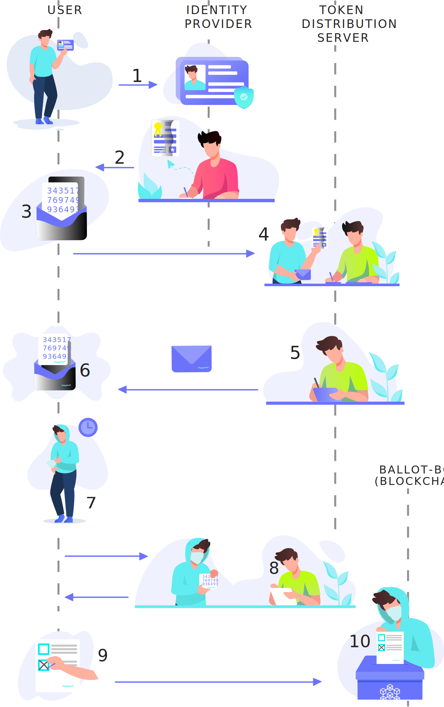

# FAQ

## How does the whole process of voting look like?

1. User proofs its identity to Identity Provider using one of the possible methods, e.g., email/password, one-time code, email confirmation, OAuth2/OpenID. 
2. Identity Provider issue certificate that is later presented to the election commission \(TDS\) proving user identity. 
3. User writes a random number \(authorization token\) on paper and puts it into the envelope with carbon paper. 
4. User shows the certificate and the envelope with the authorization token \(random number\) to the election commission \(TDS\). The certificate allows the election commission to identify the user. 
5. The election commission \(TDS\) validates the certificate and checks if the user has not already issued a ballot paper. Sign the envelope, and so the authorization token through the carbon paper. 
6. User put off the authorization token from the envelope. 
7. User waits a random amount of time outside the election local. 
8. User put the mask on his face and goes back to the election local––this time as Anonymous. The Anonymous shows the signed authorization token to the election commission \(TDS\) and redeem it for ballot-paper. 
9. Anonymous mark the candidate on the ballot paper. 
10. Anonymous throws the ballot paper into the ballot box.

## How can a user verify that his vote is correctly counted and stored in the blockchain?

A voting act is represented in the stellar transaction. This transaction transfer 1 vote token from distribution account to ballot-box account. A user itself is responsible for creating and publishing such transaction **directly** to the Stellar blockchain network. After a user successfully publishes the transaction, he obtains the transaction id, which can be used to track the transaction in the blockchain. If a user loses the transaction id, he can not prove his vote option. We considered it rather as a privacy feature than a flaw.

## Who makes the validation of transactions? Is there any organization behind Stellar that can manipulate votes ?

Stellar network uses Federated Byzantine Agreement, which is decentralized version of Byzantine Agreement. FBA allows anyone to join the network and participate in validation process. In Stellar, the validator nodes are held by many organizations, we could \(and will\) create our own Stellar nodes too. Additionally since the ballots are salt-encrypted, there is no way of filtering one kind of votes based on the vote option in it.

## Is the system decentralized ?

Right now only the crucial part of the system is decentralized, that is the database \(a.k.a. Ballot-Box\) and the client webapp. As long as this system relies on a centralized identification provider, it inherits this property too. Figure below describe the parts of the system that are considered centralized and decentralized.

## How is this app different from centralized apps?

In Stellot, besides auth, everything is recorded on the blockchain. Each user can count the voting results on its behalf, without the trust to government. The user is responsible for publishing the vote transaction to the stellar voting, so he can be sure that his vote was taken into account. But the biggest advantage is the fact that the votes are completely anonymous since no one \(besides the voter\) knows who cast the particular transaction to the network. But everyone can be sure that this transaction was authorized by TDS \(because he blindly signed the transaction\).

